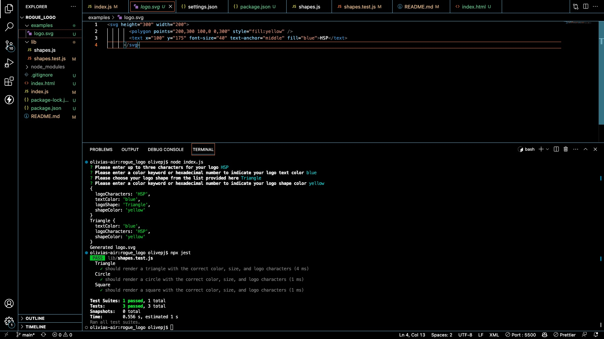

# Rogue Logo

## Description
This is a Node.js command-line application that takes in user input to generate a logo and save it as an SVG file. I wanted to learn more about CLI generated input and file creation. 
 

  ## Table of Contents: 
  - [Description](#description) 
  - [Installation](#installation)
  - [Usage](#usage) 
  - [Walkthrough Video & Screenshot](#usage) 
  - [Credits](#credits) 
  - [License](#license) This project is licensed under the MIT License. 

## Installation
1. To install this application on your own computer, you need to clone the repository to your local computer and open it in your IDE. 
2. To install the application's dependencies, run $ npm i 
3. Start the application by running the following command in your CLI:  $ node index.js

## Usage
The application prompts the user to select a color and shape, provide text for the logo, and save the generated SVG to a .svg file within the repository.

## Walkthrough Video & Screenshot
A walk-through video can of the CLI application can be viewed at [this google drive link](https://drive.google.com/file/d/1WPFtbz44dezJHouCxKQfgxgtt98pJ9LE/view)

## Credits 
These files were created by Olive Provencio-Johnson. Big thanks to my tutor Juno Nguyen and all the guidance when I felt stuck! 

## License
   

  MIT License

Copyright (c) [2023] [Olive Provencio-Johnson]

Permission is hereby granted, free of charge, to any person obtaining a copy
of this software and associated documentation files (the "Software"), to deal
in the Software without restriction, including without limitation the rights
to use, copy, modify, merge, publish, distribute, sublicense, and/or sell
copies of the Software, and to permit persons to whom the Software is
furnished to do so, subject to the following conditions:

The above copyright notice and this permission notice shall be included in all
copies or substantial portions of the Software.

THE SOFTWARE IS PROVIDED "AS IS", WITHOUT WARRANTY OF ANY KIND, EXPRESS OR
IMPLIED, INCLUDING BUT NOT LIMITED TO THE WARRANTIES OF MERCHANTABILITY,
FITNESS FOR A PARTICULAR PURPOSE AND NONINFRINGEMENT. IN NO EVENT SHALL THE
AUTHORS OR COPYRIGHT HOLDERS BE LIABLE FOR ANY CLAIM, DAMAGES OR OTHER
LIABILITY, WHETHER IN AN ACTION OF CONTRACT, TORT OR OTHERWISE, ARISING FROM,
OUT OF OR IN CONNECTION WITH THE SOFTWARE OR THE USE OR OTHER DEALINGS IN THE
SOFTWARE.